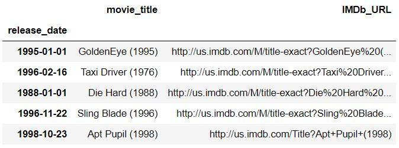

# Recommender system for MovieLens100k and imDB  (WIP)
### Exploratory Data Analysis on MovieLens100k
In the first glance we start with the famous dataset of MovieLens100k. The dataset includes a users dataset and a movies dataset.
<br><br>
##### The users dataset has included 943 Users and 21 types of occupations of users.

<br>
##### Whereas 1682 Movies and 19 genres of movies are included in the movies dataset.

<br>
### Content-based Filtering Movie Recommender
We have divided the content-based recommender into 2 parts. An item-to-item(movies' genre similarity) recommender and an user-to-user(users' preference) recommender.
##### Movies' genre similarity recommender
We formed a matrix in pandas dataframe that movie_id as the index, and genre of movies as columns for calculating distance between the movies here and the specified movie id we provided later.
```
from sklearn.preprocessing import normalize
    movie_genre_normalized = pd.DataFrame(normalize(movie_genre,axis=0))
    movie_genre_normalized.columns=movie_genre.columns
    movie_genre_normalized.index=movie_genre.index
    movie_genre_normalized
```
Write a function for recommending top 5 similar movies as per movie id provided.
```
def FindSimilarMovie(distance_method, movieID):
    allmovie = pd.DataFrame(movie_genre_normalized.index)
    remaining_movie = allmovie[allmovie['movie_id']!=movieID]
    remaining_movie['distance'] = remaining_movie['movie_id'].apply(lambda x:distance_method(movie_genre_normalized.loc[x],movie_genre_normalized.loc[movieID]))
    top_recommendation = remaining_movie.sort_values(['distance'],ascending=True).head(5)
    return top_recommendation['movie_id'].values
```
There were <b>3 distance methods</b> we tried for the recommender. And the followings are the pros and cons for the methods:

<br>
The recommended movies according to the similarity of movie_id 5 was calculated by euclidean distance method is as below.
```
FindSimilarMovie(euclidean,5)
>>> array([1069,  329,  332,  348, 1213])
```
<br>
Then we sorted out a list ordered by the rating provided by the specified user (In this case, the user id <b>186</b> was used).
```
def topN_rated(userID):
    Top_movie_rated_peruser = rating[rating['user_id']==userID].sort_values('rating',ascending=False).head(3)
    movie_list = Top_movie_rated_peruser['movie_id'].values
    return movie_list
```
<br>
Finally, we find out the similar movies with euclidean distance method based on movies the user with highest rating he watched. We output the movie title, release date and the URL to imDB for our users.

```
def topN_movie_recommendation_content(userID, distance_method,N=5):
    watched_list = rating[rating['user_id']==userID]['movie_id'].values
    
    movie_list = topN_rated(userID)
    final_movie_list = []
    for i in movie_list:
        similar_movie_list = FindSimilarMovie(distance_method,i)
        for j in similar_movie_list:
            final_movie_list.append(j)
            
    output = movie[movie.index.isin(set(final_movie_list))]
    output = output[~output.index.isin(watched_list)].head(N)
    
    return output[['movie_title','release_date','IMDb_URL']].set_index('release_date')
```
Output:
```
topN_movie_recommendation_content(186, euclidean, 5)
```


<br>
### Collaborative-based (user-user) Movie Recommender
We will find users who have similar ratings with the targeted user in collaborative-based recommender. We create a rating matrix of pivot table that user id as rows, and movie id as columns, the rating given by the users are the values.

<br>
We used hamming distance to find similar users with similar rating on movies for the user. Then we manipulate the similar users list to sort out the top 10 favourite movies to recommend to our user.
```
from scipy.spatial.distance import hamming
def similaruser(userID,K):
    alluser = pd.DataFrame(rating_matrix.index)
    alluser = alluser[alluser['user_id']!=userID]
    alluser['distance'] = alluser['user_id'].apply(lambda x: hamming(rating_matrix.loc[userID],rating_matrix.loc[x]))
    nearestuser_list = alluser.sort_values('distance',ascending=True)['user_id'].head(K).values
    return nearestuser_list
    
def topN_movie_recommendation_collaborative(userID, N=5):
    nearestuser_list = similaruser(userID,10)
    new_matrix = rating_matrix[rating_matrix.index.isin(nearestuser_list)]
    avg_rating = new_matrix.apply(np.nanmean).dropna()
    watched_list = rating[rating['user_id']==userID]['movie_id'].values
    avg_rating = avg_rating[~avg_rating.index.isin(watched_list)]
    top_movieID = avg_rating.sort_values(ascending=False).index[:N]
    
    output = movie[movie.index.isin(set(top_movieID))]
    
    return output[['movie_title','release_date','IMDb_URL']].set_index('release_date')
```
Output:
```
topN_movie_recommendation_collaborative(186, N=5)
```


<br>
