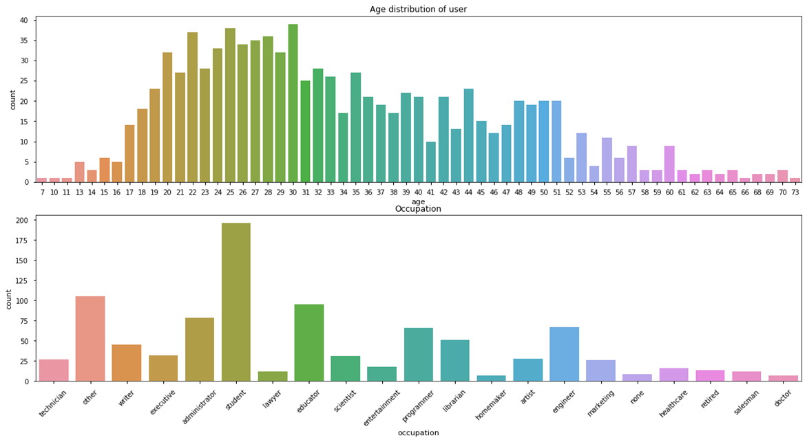
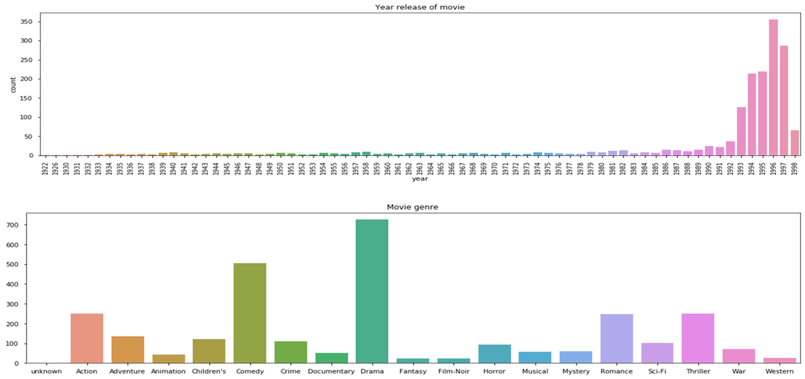
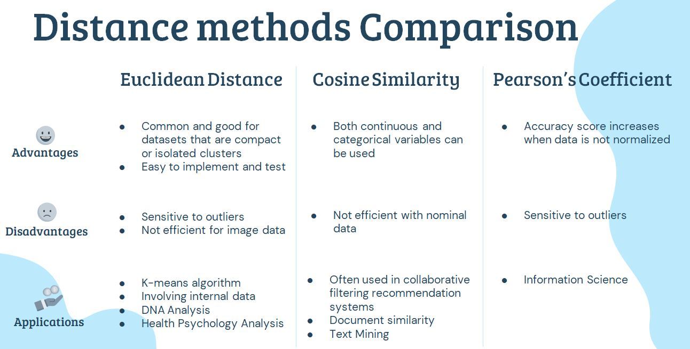
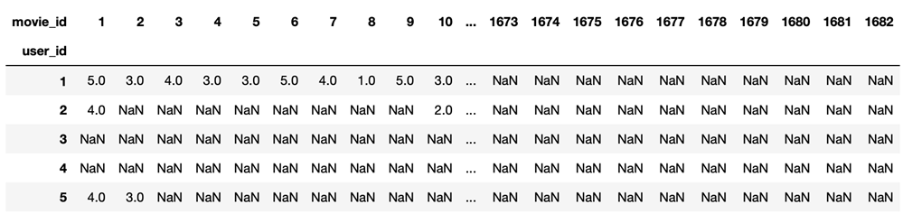

# Recommender system for MovieLens100k and imDB
### Exploratory Data Analysis on MovieLens100k
In the first glance we start with the famous dataset of MovieLens100k. The dataset includes a users dataset and a movies dataset.
<br>
##### The users dataset has included 943 Users and 21 types of occupations of users.

<br>
##### Whereas 1682 Movies and 19 genres of movies are included in the movies dataset.

<br>
### Content-based Filtering Movie Recommender
We have divided the content-based recommender into 2 parts. An item-to-item(movies' genre similarity) recommender and an user-to-user(users' preference) recommender.
##### Movies' genre similarity recommender
We formed a matrix in pandas dataframe that movie_id as index, and genre of movies as columns for calculating distance between the movies here and the specified movie id we provided later.
```
from sklearn.preprocessing import normalize
    movie_genre_normalized = pd.DataFrame(normalize(movie_genre,axis=0))
    movie_genre_normalized.columns=movie_genre.columns
    movie_genre_normalized.index=movie_genre.index
    movie_genre_normalized
```
Write a function for recommending top 5 similar movies as per movie id provided.
```
def FindSimilarMovie(distance_method, movieID):
    allmovie = pd.DataFrame(movie_genre_normalized.index)
    remaining_movie = allmovie[allmovie['movie_id']!=movieID]
    remaining_movie['distance'] = remaining_movie['movie_id'].apply(lambda x:distance_method(movie_genre_normalized.loc[x],movie_genre_normalized.loc[movieID]))
    top_recommendation = remaining_movie.sort_values(['distance'],ascending=True).head(5)
    return top_recommendation['movie_id'].values
```
There were <b>3 distance methods</b> we tried for the recommender. And the followings are the pros and cons for the methods:

<br>
The recommended movies according to the similarity of movie_id 5 was calculated by euclidean distance method is as below.
```
FindSimilarMovie(euclidean,5)
>>> array([1069,  329,  332,  348, 1213])
```
<br>
Then we sorted out a list ordered by the rating provided by the specified user (In this case, the user id <b>186</b> was used).

```
def topN_rated(userID):
    Top_movie_rated_peruser = rating[rating['user_id']==userID].sort_values('rating',ascending=False).head(3)
    movie_list = Top_movie_rated_peruser['movie_id'].values
    return movie_list
```
<br>
Finally, we find out the similar movies with euclidean distance method based on movies the user with highest rating he watched. We output the movie title, release date and the URL to imDB for our users.

```
def topN_movie_recommendation_content(userID, distance_method,N=5):
    watched_list = rating[rating['user_id']==userID]['movie_id'].values
    
    movie_list = topN_rated(userID)
    final_movie_list = []
    for i in movie_list:
        similar_movie_list = FindSimilarMovie(distance_method,i)
        for j in similar_movie_list:
            final_movie_list.append(j)
            
    output = movie[movie.index.isin(set(final_movie_list))]
    output = output[~output.index.isin(watched_list)].head(N)
    
    return output[['movie_title','release_date','IMDb_URL']].set_index('release_date')
```
Output:
```
topN_movie_recommendation_content(186, euclidean, 5)
```


<br>
### Collaborative-based (user-user) Movie Recommender
We will find users who have similar ratings with the targeted user in collaborative-based recommender. We create a rating matrix of pivot table that user id as rows, and movie id as columns, the rating given by the users are the values.

<br>
We used hamming distance to find similar users with similar rating on movies for the user. Then we manipulate the similar users list to sort out the top 10 favourite movies to recommend to our user.
```
from scipy.spatial.distance import hamming
def similaruser(userID,K):
    alluser = pd.DataFrame(rating_matrix.index)
    alluser = alluser[alluser['user_id']!=userID]
    alluser['distance'] = alluser['user_id'].apply(lambda x: hamming(rating_matrix.loc[userID],rating_matrix.loc[x]))
    nearestuser_list = alluser.sort_values('distance',ascending=True)['user_id'].head(K).values
    return nearestuser_list
    
def topN_movie_recommendation_collaborative(userID, N=5):
    nearestuser_list = similaruser(userID,10)
    new_matrix = rating_matrix[rating_matrix.index.isin(nearestuser_list)]
    avg_rating = new_matrix.apply(np.nanmean).dropna()
    watched_list = rating[rating['user_id']==userID]['movie_id'].values
    avg_rating = avg_rating[~avg_rating.index.isin(watched_list)]
    top_movieID = avg_rating.sort_values(ascending=False).index[:N]
    
    output = movie[movie.index.isin(set(top_movieID))]
    
    return output[['movie_title','release_date','IMDb_URL']].set_index('release_date')
```
Output:
```
topN_movie_recommendation_collaborative(186, N=5)
```


<br>

##### Matrix factorization (SVD and NMF)
Matrix factorization is a class of collaborative filtering algorithms used in recommender systems. For example, if we have 1000 movies and 2000 user-ratings, then we would have 1000 x 2000 = 2,000,000 results (a user-item interaction matrix) to process. 
<br><br>
To save time and resources, we can decompose (feature extraction) the matrix into the product of two lower dimensionality rectangular matrices. By that mean, for instance, we now have two matrixs and 100 features were extracted. Then, we only need to handle (1000 movies x 100 features) + (2000 user-ratings x 100 features) = 300,000 results.
<br><br>
We use a python module called "surprise". And start with preparing the dataset.

```
reader = Reader(rating_scale=(0.5,5))
datamf = Dataset.load_from_df(m_info[["user_id","movie_id","rating"]],reader= reader)

# split to train/test set.
trainset = datamf.build_full_trainset()
testset = trainset.build_anti_testset()
```

There were 2 methods we applied. The first one we used SVD (Singular Value Decomposition). By applying gridsearch, we find the best parameter for n_factors.

```
param_grid={'n_factors': [i for i in range(39)]}
gs = GridSearchCV(SVD, param_grid, measures=['rmse'] ,cv=5)
gs.fit(datamf)
```

Calculate the rmse for review.

```
def rmse_vs_factors(algorithm, data, n):
    rmse = []
    for k in range(1, n, 1):
        algo = algorithm(n_factors = k)
        loss_fce = cross_validate(algo, data, measures=['RMSE'], cv=5, verbose=False)["test_rmse"].mean() 
        rmse.append(loss_fce)
    return rmse
    
rmse_svd = rmse_vs_factors(SVD, datamf, 38)
```

And plot it with matplotlib.

```
def plot_rmse(rmse,algo):
    plt.figure(num=None,figsize=(11,5))
    plt.subplot(2,1,1)
    plt.plot(rmse)
    plt.xlim(0,38)
    plt.title("{} Performance: RMSE against number of factors".format(algo),size = 20)
    plt.ylabel("Mean RMSE (cv=5)")
    
    plt.subplot(2,1,2)
    plt.plot(rmse)
    plt.xlim(0,38)
    plt.xticks(np.arange(0,38, step = 2))
    
    plt.xlabel("{} (n_factor = k)".format(algo))
    plt.ylabel("Mean RMSE (cv=5)")
    plt.axvline(np.argmin(rmse), color = 'r')
```


We fit the algorithm to the train and test datasets.

```
algo_svd = SVD(n_factors = 36)
algo_svd.fit(trainset)
pred = algo_svd.test(testset)

pred[0:3]
>>> [Prediction(uid=196, iid=302, r_ui=3.52986, est=4.153977643120968, details={'was_impossible': False}),
     Prediction(uid=196, iid=377, r_ui=3.52986, est=2.5743676371295616, details={'was_impossible': False}),
     Prediction(uid=196, iid=51, r_ui=3.52986, est=3.4589699181207045, details={'was_impossible': False})]
```

At last, we output a recommendation to specified user id from SVD

```
def top_n_recommendation(predictions, userid, moviesdf, ratingdf, n=10):
    top_n = defaultdict(list)
    for uid,iid,true,est,details in predictions:
        top_n[uid].append((iid,est))
    
    for uid,user_ratings in top_n.items():
        user_ratings.sort(key = lambda x:x[1], reverse = True)
        top_n[uid] = user_ratings[:n]
    
    preds_df = pd.DataFrame([(id,pair[0],pair[1]) for id, row in top_n.items() for pair in row],
                           columns = ["user_id", "movie_id", "rate_pred"])
    
    preds_user = preds_df[preds_df["user_id"] == (userid)].merge(m_item, how = 'left'
                                                                 ,left_on ='movie_id',right_on='movie_id')
    
    return preds_user
    
pred_SVD_124=top_n_recommendation(pred,userid=124, moviesdf=m_item, ratingdf=m_info)
print(pred_SVD_124[['movie_id', 'rate_pred', 'movie title']])
```


and then we repeated the process in NMF (Non-negative Matrix Factorization).

```
rmse_nmf = rmse_vs_factors(NMF, datamf, 23)
```


```
algo_nmf = NMF(n_factors = 15)
algo_nmf.fit(trainset)
pred = algo_nmf.test(testset)

print(pred[0:3])
>>>[Prediction(uid=196, iid=302, r_ui=3.52986, est=3.964583659551264, details={'was_impossible': False}), 
    Prediction(uid=196, iid=377, r_ui=3.52986, est=1.800256708618275, details={'was_impossible': False}), 
    Prediction(uid=196, iid=51, r_ui=3.52986, est=3.4089824235788955, details={'was_impossible': False})]
    
pred_nmf_186=top_n_recommendation(pred,userid=186,moviesdf=m_item,ratingdf=m_info)
print(pred_nmf_186[['release_date','movie title']])
```


<!-- The prediction results can be improved by assigning different regularization weights to the latent factors based on items' popularity and users' activeness. -->
<br>

### IMDB Movie Recommender Bot
Since the dataset of movielens100k contains only movies prior years of 2000. We decide to do a movie recommender in the present movies. We scraped the "Movie Name", "Genre", "Category", "Director", "Cast" & "Votes" of Featured films with rating counts at least 25,000 from the IMDB website.
<br>


Data processed.


We will use Rasa for chatbot and creating a webhook between the bot and Slacks.
<br>
Below is our flow for our Rasa chatbot.
<br>

<br>


<br>
Get recommendation from the bot.

<!--  -->
Plot of the movie.
<br>

<br>
Movie review.

<br>
Start the webhook with Slacks.

<br>
Our Rasa Movie Recommender on Slacks.

